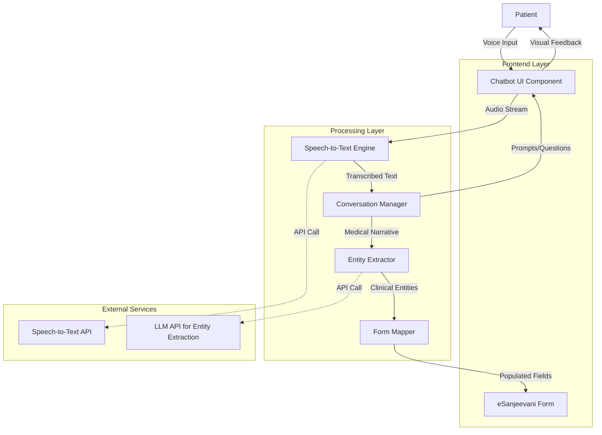

# Design Document: AskShruti! Voice Assistant

## Overview

AskShruti! is a conversational AI voice assistant that transforms the eSanjeevani case-intake form-filling experience from a complex text-based process into a natural voice conversation. The system consists of four primary components working in a pipeline: a chatbot UI for user interaction, a speech-to-text transcription engine supporting vernacular languages, a clinical entity extraction engine powered by generative AI, and a form mapping service that populates eSanjeevani form fields with extracted medical information.

The architecture follows a modular design where each component can be independently developed, tested, and upgraded. The system prioritizes user experience for low-literacy and elderly populations through large UI elements, clear audio feedback, and natural conversation flows. Security and privacy are built into every layer, with encrypted transmission, minimal data retention, and compliance with healthcare regulations.

Key design decisions:
- **Stateful conversation management**: Maintains context across multiple patient utterances to build a complete medical narrative
- **Hybrid verification approach**: Combines AI confidence scoring with mandatory human review before submission
- **Progressive enhancement**: Core form-filling functionality remains available if voice features fail
- **Language-agnostic entity extraction**: Uses multilingual models that can be extended to additional Indian languages

## Architecture

### System Components



### Component Responsibilities

#### Chatbot UI Component

- Renders the chatbot interface (icon, expanded conversation window)
- Captures audio input from the patient's microphone
- Displays transcribed text and AI responses in real-time
- Provides visual indicators for system state (listening, processing, ready)
- Handles language selection and user preferences
- Manages the review and confirmation flow

#### Speech-to-Text Engine

- Receives audio streams from the UI component
- Performs language-specific speech recognition
- Returns transcribed text with confidence scores
- Handles audio quality issues and background noise
- Supports Hindi, English, and extensible to other vernacular languages

#### Conversation Manager

- Orchestrates the conversation flow (greeting → symptoms → history → medications → allergies → review)
- Maintains conversation state and context across multiple utterances
- Generates contextual prompts and follow-up questions
- Determines when sufficient information has been collected
- Handles conversation branching based on patient responses

#### Entity Extractor

- Processes transcribed text using a generative AI model (LLM)
- Identifies clinical entities: symptoms, medical history, medications, allergies
- Extracts structured data from unstructured patient narratives
- Assigns confidence scores to extracted entities
- Handles medical terminology in multiple languages
- Requests clarification for ambiguous or low-confidence extractions

#### Form Mapper

- Maps extracted clinical entities to eSanjeevani form field identifiers
- Transforms entity values into form-compatible formats
- Handles multi-value fields (e.g., multiple symptoms or medications)
- Validates mapped data against form constraints
- Preserves unmapped entities for manual review

### Data Flow

1. **Initiation**: Patient clicks AskShruti icon → UI displays language selection
2. **Voice Capture**: Patient speaks → UI streams audio to Speech-to-Text Engine
3. **Transcription**: Speech-to-Text Engine returns text → UI displays transcription
4. **Context Building**: Conversation Manager accumulates transcribed text and maintains medical narrative
5. **Entity Extraction**: When patient completes a topic, Entity Extractor processes the narrative segment
6. **Form Population**: Form Mapper receives entities and populates corresponding form fields
7. **Iterative Collection**: Conversation Manager prompts for next topic, repeating steps 2-6
8. **Review**: Once all topics covered, UI displays populated form for patient verification
9. **Confirmation**: Patient reviews, corrects if needed, and confirms → Form is saved

### Technology Stack Recommendations

#### Frontend

- React or Vue.js for the chatbot UI component
- Web Audio API for microphone access and audio streaming
- WebSocket or Server-Sent Events for real-time transcription updates
- Responsive CSS framework for accessibility (large buttons, high contrast)

#### Speech-to-Text

- AWS Transcribe Medical (supports Hindi and English with medical vocabulary)
- Alternative: Azure Speech Services
- Streaming recognition for real-time feedback
- Language-specific models with medical terminology support

#### Entity Extraction

- OpenAI GPT-4 or GPT-3.5 with medical prompt engineering
- Alternative: Anthropic Claude or AWS Bedrock with medical models
- Structured output format (JSON) for entity extraction
- Few-shot prompting with medical examples in Hindi and English

#### Backend

- Node.js or Python (FastAPI) for API services
- WebSocket server for real-time audio streaming
- Redis for session state management
- PostgreSQL for conversation logs (if retention is required)

#### Integration

- REST API or SDK integration with eSanjeevani platform
- OAuth 2.0 or JWT for authentication
- HTTPS with TLS 1.3 for encrypted communication

## Components and Interfaces

### Chatbot UI Component

#### Interface: ChatbotUI

```typescript
interface ChatbotUI {
  // Lifecycle methods
  initialize(containerId: string, config: UIConfig): void
  open(): void
  close(): void
  reset(): void
  
  // Audio capture
  startListening(): Promise<void>
  stopListening(): void
  
  // Display methods
  displayMessage(message: Message): void
  displayTranscription(text: string, confidence: number): void
  displayFormPreview(formData: FormData): void
  
  // User interaction
  onLanguageSelect(callback: (language: Language) => void): void
  onConfirmation(callback: (confirmed: boolean) => void): void
  onCorrection(callback: (field: string, value: string) => void): void
  
  // State management
  setState(state: UIState): void
  getState(): UIState
}

interface UIConfig {
  languages: Language[]
  position: 'bottom-right' | 'bottom-left'
  theme: 'light' | 'dark' | 'high-contrast'
  audioConfig: AudioConfig
}

interface Message {
  id: string
  type: 'system' | 'user' | 'error'
  text: string
  timestamp: Date
  language: Language
}

enum UIState {
  MINIMIZED = 'minimized',
  LANGUAGE_SELECTION = 'language_selection',
  LISTENING = 'listening',
  PROCESSING = 'processing',
  DISPLAYING_RESPONSE = 'displaying_response',
  REVIEWING_FORM = 'reviewing_form',
  ERROR = 'error'
}
```

### Speech-to-Text Engine

#### Interface: TranscriptionEngine

```typescript
interface TranscriptionEngine {
  // Configuration
  configure(config: STTConfig): void
  
  // Transcription methods
  transcribeStream(audioStream: AudioStream, language: Language): Promise<TranscriptionResult>
  transcribeAudio(audioBuffer: ArrayBuffer, language: Language): Promise<TranscriptionResult>
  
  // Language support
  getSupportedLanguages(): Language[]
  setLanguage(language: Language): void
}

interface STTConfig {
  apiKey: string
  endpoint: string
  sampleRate: number
  encoding: AudioEncoding
  enableAutomaticPunctuation: boolean
  model: 'default' | 'medical' | 'command'
}

interface TranscriptionResult {
  text: string
  confidence: number
  language: Language
  alternatives?: TranscriptionAlternative[]
  timestamp: Date
}

interface TranscriptionAlternative {
  text: string
  confidence: number
}

enum AudioEncoding {
  LINEAR16 = 'LINEAR16',
  FLAC = 'FLAC',
  MULAW = 'MULAW',
  AMR = 'AMR',
  OGG_OPUS = 'OGG_OPUS'
}
```

### Conversation Manager

#### Interface: ConversationManager

```typescript
interface ConversationManager {
  // Session management
  startSession(sessionId: string, language: Language): void
  endSession(sessionId: string): void
  
  // Conversation flow
  getGreeting(language: Language): string
  getNextPrompt(sessionId: string): Prompt
  processUserInput(sessionId: string, transcription: TranscriptionResult): ConversationState
  
  // State management
  getConversationState(sessionId: string): ConversationState
  updateContext(sessionId: string, context: ConversationContext): void
  
  // Completion detection
  isTopicComplete(sessionId: string, topic: Topic): boolean
  isConversationComplete(sessionId: string): boolean
}

interface Prompt {
  text: string
  type: PromptType
  topic: Topic
  language: Language
}

enum PromptType {
  GREETING = 'greeting',
  TOPIC_INTRODUCTION = 'topic_introduction',
  FOLLOW_UP = 'follow_up',
  CLARIFICATION = 'clarification',
  CONFIRMATION = 'confirmation',
  REVIEW = 'review'
}

enum Topic {
  SYMPTOMS = 'symptoms',
  MEDICAL_HISTORY = 'medical_history',
  MEDICATIONS = 'medications',
  ALLERGIES = 'allergies'
}

interface ConversationState {
  sessionId: string
  currentTopic: Topic
  completedTopics: Topic[]
  accumulatedNarrative: Map<Topic, string>
  extractedEntities: ClinicalEntity[]
  language: Language
  timestamp: Date
}

interface ConversationContext {
  previousUtterances: string[]
  clarificationNeeded: boolean
  missingInformation: string[]
}
```

### Entity Extractor

#### Interface: EntityExtractor

```typescript
interface EntityExtractor {
  // Configuration
  configure(config: ExtractionConfig): void
  
  // Extraction methods
  extractEntities(narrative: string, language: Language, topic: Topic): Promise<ExtractionResult>
  extractEntitiesWithContext(narrative: string, context: ConversationContext, language: Language): Promise<ExtractionResult>
  
  // Validation
  validateExtraction(entities: ClinicalEntity[]): ValidationResult
}

interface ExtractionConfig {
  modelName: string
  apiKey: string
  endpoint: string
  temperature: number
  maxTokens: number
  promptTemplate: string
}

interface ExtractionResult {
  entities: ClinicalEntity[]
  confidence: number
  ambiguities: Ambiguity[]
  rawResponse: string
  processingTime: number
}

interface ClinicalEntity {
  id: string
  type: EntityType
  value: string
  normalizedValue?: string
  confidence: number
  sourceText: string
  language: Language
  metadata?: EntityMetadata
}

enum EntityType {
  SYMPTOM = 'symptom',
  DIAGNOSIS = 'diagnosis',
  MEDICATION = 'medication',
  DOSAGE = 'dosage',
  ALLERGY = 'allergy',
  MEDICAL_HISTORY = 'medical_history',
  DURATION = 'duration',
  SEVERITY = 'severity'
}

interface EntityMetadata {
  startDate?: Date
  endDate?: Date
  frequency?: string
  severity?: 'mild' | 'moderate' | 'severe'
  bodyPart?: string
}

interface Ambiguity {
  entityId: string
  reason: string
  clarificationQuestion: string
  alternatives: string[]
}

interface ValidationResult {
  isValid: boolean
  errors: ValidationError[]
  warnings: ValidationWarning[]
}

interface ValidationError {
  entityId: string
  message: string
  severity: 'error' | 'warning'
}

interface ValidationWarning {
  entityId: string
  message: string
  suggestion: string
}
```

### Form Mapper

#### Interface: FormMapper

```typescript
interface FormMapper {
  // Configuration
  configure(formSchema: FormSchema): void
  
  // Mapping methods
  mapEntitiesToForm(entities: ClinicalEntity[]): FormData
  mapEntityToField(entity: ClinicalEntity): FieldMapping[]
  
  // Validation
  validateFormData(formData: FormData): FormValidationResult
  
  // Utilities
  getUnmappedEntities(entities: ClinicalEntity[]): ClinicalEntity[]
  getEmptyRequiredFields(formData: FormData): string[]
}

interface FormSchema {
  formId: string
  version: string
  fields: FormField[]
  validationRules: ValidationRule[]
}

interface FormField {
  fieldId: string
  fieldName: string
  fieldType: FieldType
  required: boolean
  multiValue: boolean
  acceptedEntityTypes: EntityType[]
  validationPattern?: string
  maxLength?: number
}

enum FieldType {
  TEXT = 'text',
  TEXTAREA = 'textarea',
  SELECT = 'select',
  MULTI_SELECT = 'multi_select',
  DATE = 'date',
  NUMBER = 'number'
}

interface FieldMapping {
  fieldId: string
  value: string
  confidence: number
  sourceEntityId: string
}

interface FormData {
  formId: string
  fields: Map<string, FieldValue>
  metadata: FormMetadata
}

interface FieldValue {
  value: string | string[]
  confidence: number
  sourceEntityIds: string[]
  manuallyEdited: boolean
}

interface FormMetadata {
  sessionId: string
  completionTime: number
  language: Language
  autoPopulatedFields: string[]
  manuallyEditedFields: string[]
}

interface FormValidationResult {
  isValid: boolean
  errors: FieldError[]
  warnings: FieldWarning[]
  completeness: number // percentage of required fields filled
}

interface FieldError {
  fieldId: string
  message: string
  currentValue: string
}

interface FieldWarning {
  fieldId: string
  message: string
  suggestion: string
}
```

### Common Types

```typescript
enum Language {
  HINDI = 'hi',
  ENGLISH = 'en',
  TAMIL = 'ta',
  TELUGU = 'te',
  BENGALI = 'bn',
  MARATHI = 'mr',
  GUJARATI = 'gu',
  KANNADA = 'kn',
  MALAYALAM = 'ml',
  PUNJABI = 'pa'
}

interface AudioStream {
  stream: MediaStream
  sampleRate: number
  channels: number
  encoding: AudioEncoding
}

interface AudioConfig {
  sampleRate: number
  channels: number
  encoding: AudioEncoding
  echoCancellation: boolean
  noiseSuppression: boolean
}
```

## Data Models

### Session Data Model

The session represents a single patient interaction with AskShruti from initiation to form submission.

```typescript
interface Session {
  sessionId: string
  patientId?: string // Optional, may not be available until form submission
  startTime: Date
  endTime?: Date
  language: Language
  conversationState: ConversationState
  transcriptions: Transcription[]
  extractedEntities: ClinicalEntity[]
  formData: FormData
  status: SessionStatus
}

enum SessionStatus {
  ACTIVE = 'active',
  REVIEWING = 'reviewing',
  COMPLETED = 'completed',
  ABANDONED = 'abandoned',
  ERROR = 'error'
}

interface Transcription {
  id: string
  sessionId: string
  audioUrl?: string // Optional, only if audio is retained
  text: string
  confidence: number
  language: Language
  timestamp: Date
  topic: Topic
}
```

### Entity Storage Model

Clinical entities extracted from patient narratives, stored for form mapping and potential audit trails.

```typescript
interface StoredEntity {
  id: string
  sessionId: string
  type: EntityType
  value: string
  normalizedValue?: string
  confidence: number
  sourceText: string
  sourceTranscriptionId: string
  language: Language
  metadata?: EntityMetadata
  createdAt: Date
  mappedToField?: string
}
```

### Form Mapping Model

Tracks the relationship between extracted entities and form fields for transparency and debugging.

```typescript
interface MappingRecord {
  id: string
  sessionId: string
  entityId: string
  fieldId: string
  mappedValue: string
  confidence: number
  manuallyOverridden: boolean
  overrideReason?: string
  createdAt: Date
  updatedAt?: Date
}
```

### Audit Log Model

For compliance and quality improvement, tracks all system actions and decisions.

```typescript
interface AuditLog {
  id: string
  sessionId: string
  timestamp: Date
  component: string // 'UI', 'STT', 'ConversationManager', 'EntityExtractor', 'FormMapper'
  action: string
  details: Record<string, any>
  userId?: string
  ipAddress?: string
}
```


## Correctness Properties

A property is a characteristic or behavior that should hold true across all valid executions of a system—essentially, a formal statement about what the system should do. Properties serve as the bridge between human-readable specifications and machine-verifiable correctness guarantees.

### Language and Localization Properties

**Property 1: Language consistency across all interactions**
*For any* selected language and any system message or prompt, all displayed text should be in the selected language.
**Validates: Requirements 1.3, 2.4**

**Property 2: Language-specific model selection**
*For any* language selection, the Transcription_Engine should load and use the speech recognition model corresponding to that language.
**Validates: Requirements 2.2**

**Property 3: Supported languages availability**
*For any* configured language in the system, that language should appear as an option in the language selection menu.
**Validates: Requirements 2.5**

### Transcription Properties

**Property 4: Speech-to-text conversion**
*For any* valid audio input in a supported language, the Transcription_Engine should return transcribed text in that language with a confidence score.
**Validates: Requirements 1.4**

**Property 5: Transcription display feedback**
*For any* completed transcription result, the UI should display the transcribed text to the patient.
**Validates: Requirements 1.5**

**Property 6: Low-confidence segment highlighting**
*For any* transcription segment with confidence below the threshold, that segment should be visually highlighted in the UI.
**Validates: Requirements 7.2**

**Property 7: Transcription correction availability**
*For any* displayed transcription, the patient should be able to trigger re-speaking or manual text editing.
**Validates: Requirements 7.3**

### Conversation Flow Properties

**Property 8: Pause acknowledgment**
*For any* detected pause in patient speech, the system should provide an acknowledgment message.
**Validates: Requirements 1.6**

**Property 9: Topic progression**
*For any* completed conversation topic, the Conversation Manager should generate a prompt for the next uncompleted topic in the sequence (symptoms → history → medications → allergies).
**Validates: Requirements 8.2**

**Property 10: Incomplete information follow-up**
*For any* patient response that is missing required information for the current topic, the Conversation Manager should generate a follow-up question requesting the missing details.
**Validates: Requirements 8.3**

**Property 11: Conversation completion detection**
*For any* conversation state where all required topics have been completed, the system should transition to the review phase and present a summary.
**Validates: Requirements 8.4**

**Property 12: Topic navigation flexibility**
*For any* conversation topic, the patient should be able to skip it (if optional) or return to it from a later topic.
**Validates: Requirements 8.5**

### Entity Extraction Properties

**Property 13: Clinical entity extraction by type**
*For any* patient narrative containing medical information, the Entity_Extractor should identify and extract entities of all relevant types (symptoms, medical history, medications, allergies) present in the text.
**Validates: Requirements 3.1, 3.2, 3.3, 3.4**

**Property 14: Entity type categorization**
*For any* extracted clinical entity, it should be assigned exactly one valid EntityType (SYMPTOM, DIAGNOSIS, MEDICATION, DOSAGE, ALLERGY, MEDICAL_HISTORY, DURATION, SEVERITY).
**Validates: Requirements 3.5**

**Property 15: Ambiguity detection and clarification**
*For any* extraction result containing entities with confidence below the ambiguity threshold, the system should generate clarifying questions for those entities.
**Validates: Requirements 3.6**

**Property 16: Multi-language entity extraction**
*For any* medical term in a supported language, the Entity_Extractor should correctly identify it as a clinical entity when present in patient narratives.
**Validates: Requirements 2.3**

### Form Mapping Properties

**Property 17: Entity-to-field mapping completeness**
*For any* extracted clinical entity, the Form_Mapper should either map it to at least one form field or mark it as unmappable.
**Validates: Requirements 4.1**

**Property 18: Field population from entities**
*For any* entity mapped to a form field, that field should contain the entity's value (or normalized value) in the populated form.
**Validates: Requirements 4.2**

**Property 19: Multi-value field combination**
*For any* set of entities that map to the same multi-value form field, all entity values should be combined and present in that field.
**Validates: Requirements 4.3**

**Property 20: Form schema preservation**
*For any* form populated by the Form_Mapper, all original validation rules from the form schema should still apply and be enforced.
**Validates: Requirements 4.5**

### Review and Verification Properties

**Property 21: Form population triggers review**
*For any* completed form mapping operation, the system should display the review screen with all populated fields.
**Validates: Requirements 4.4, 5.1**

**Property 22: Auto-populated field highlighting**
*For any* form field that was populated by the Form_Mapper (not manually edited), that field should be visually distinguished in the review screen.
**Validates: Requirements 5.2**

**Property 23: Field correction availability**
*For any* field in the review screen, the patient should be able to modify its value through voice input or manual editing.
**Validates: Requirements 5.3**

**Property 24: Confirmation enables submission**
*For any* form in review state, the save/submit action should be disabled until the patient explicitly confirms accuracy, then enabled after confirmation.
**Validates: Requirements 5.4, 5.5**

### UI Integration Properties

**Property 25: Chatbot state preservation on minimize**
*For any* active conversation, closing the chatbot UI and then reopening it should restore the conversation state (messages, extracted entities, form data).
**Validates: Requirements 6.4**

**Property 26: Non-obstructive UI layout**
*For any* open chatbot interface, no critical form elements should be obscured or inaccessible.
**Validates: Requirements 6.3**

**Property 27: System state visual indicators**
*For any* system state (listening, processing, idle, error), the UI should display the corresponding visual indicator.
**Validates: Requirements 6.5, 10.5**

### Error Handling Properties

**Property 28: Component failure recovery**
*For any* component failure (Transcription_Engine, Entity_Extractor), the system should notify the patient in their selected language and offer appropriate recovery options (retry, manual input, fallback).
**Validates: Requirements 9.1, 9.2, 9.4**

**Property 29: Network failure resilience**
*For any* network connectivity loss during an active session, the system should save the conversation state to local storage and restore it when connectivity returns.
**Validates: Requirements 9.3**

**Property 30: Error logging**
*For any* error or exception that occurs in any component, an audit log entry should be created with error details.
**Validates: Requirements 9.5**

**Property 31: Noise detection notification**
*For any* transcription attempt where background noise is detected above the threshold, the system should notify the patient and suggest finding a quieter environment.
**Validates: Requirements 7.5**

### Performance Properties

**Property 32: Transcription processing latency**
*For any* completed speech input, the Transcription_Engine should begin processing within 500 milliseconds.
**Validates: Requirements 10.1**

**Property 33: Entity extraction latency**
*For any* transcribed text, the Entity_Extractor should complete processing and return results within 2 seconds.
**Validates: Requirements 10.2**

**Property 34: Form mapping latency**
*For any* set of extracted entities, the Form_Mapper should complete field population within 1 second.
**Validates: Requirements 10.3**

### Security and Privacy Properties

**Property 35: Audio transmission encryption**
*For any* audio data transmitted from the client to the server, the transmission should use encrypted channels (TLS 1.3 or higher).
**Validates: Requirements 11.1**

**Property 36: Audio deletion after transcription**
*For any* audio recording that has been successfully transcribed, the audio file should be deleted from storage unless explicitly flagged for quality review.
**Validates: Requirements 11.2**

**Property 37: Session data retention limits**
*For any* completed or abandoned session, conversation data should be cleared from temporary storage within the session timeout period unless required for medical records.
**Validates: Requirements 11.4**

**Property 38: Secure API authentication**
*For any* API call to external services (eSanjeevani, speech-to-text, LLM), the request should include valid authentication credentials (OAuth token, API key).
**Validates: Requirements 11.5**

### Accessibility Properties

**Property 39: Minimum interactive element sizes**
*For any* interactive UI element (button, input field, clickable icon), the element should meet minimum size requirements (44x44 pixels for touch targets).
**Validates: Requirements 12.1, 12.4**

**Property 40: Audio feedback for actions**
*For any* user action (button click, form submission, error occurrence), the system should provide corresponding audio feedback.
**Validates: Requirements 12.2**

**Property 41: Screen reader compatibility**
*For any* UI component, when a screen reader is detected, the component should have appropriate ARIA labels and semantic HTML markup.
**Validates: Requirements 12.5**


## Error Handling

### Error Categories

#### 1. Transcription Errors

- **Audio quality issues**: Background noise, low volume, unclear speech
- **Unsupported language**: Patient speaks in a language not configured
- **API failures**: Speech-to-text service unavailable or rate-limited
- **Network errors**: Connection loss during audio streaming

##### Recovery Strategy

- Display transcription confidence scores to patient
- Offer re-recording option for low-confidence transcriptions
- Provide manual text input as fallback
- Cache audio locally and retry on network recovery
- Show clear error messages: "I couldn't hear you clearly. Please try speaking again in a quieter place."

#### 2. Entity Extraction Errors

- **Ambiguous medical terms**: Terms with multiple meanings
- **Incomplete information**: Patient provides partial details
- **LLM API failures**: Service unavailable or timeout
- **Unexpected response format**: LLM returns malformed JSON

##### Recovery Strategy

- Ask clarifying questions for ambiguous terms
- Prompt for missing information with specific questions
- Preserve transcribed text even if extraction fails
- Allow manual form filling as fallback
- Implement retry logic with exponential backoff for API failures
- Validate LLM responses against expected schema before processing

#### 3. Form Mapping Errors

- **Unknown entity types**: Extracted entities don't match any form field
- **Validation failures**: Mapped values violate form constraints
- **Missing required fields**: Not all required fields populated
- **Type mismatches**: Entity value incompatible with field type

##### Recovery Strategy

- Store unmapped entities for manual review
- Display validation errors with specific field references
- Highlight missing required fields in review screen
- Provide type conversion with error handling (e.g., date parsing)
- Allow manual correction of any field before submission

#### 4. UI and Integration Errors

- **Microphone access denied**: Browser blocks audio capture
- **Browser compatibility**: Unsupported browser or old version
- **eSanjeevani integration failures**: API errors, authentication issues
- **Session timeout**: Patient inactive for extended period

##### Recovery Strategy

- Request microphone permissions with clear explanation
- Display browser compatibility warnings with upgrade instructions
- Implement graceful degradation to manual form filling
- Save session state to local storage periodically
- Restore session on page reload if within timeout window
- Provide clear instructions for resolving integration issues

### Error Message Localization

All error messages must be available in all supported languages. Error messages should:

- Be written in simple, non-technical language
- Explain what went wrong in patient-friendly terms
- Provide clear next steps or recovery actions
- Avoid technical jargon or error codes (log those separately)

#### Example Error Messages

**English:**

- "I couldn't understand that. Could you please repeat?"
- "I'm having trouble connecting. Please check your internet and try again."
- "I need more information about your symptoms. Can you describe them in more detail?"

**Hindi:**

- "मैं समझ नहीं पाया। क्या आप कृपया दोहरा सकते हैं?"
- "मुझे कनेक्ट करने में परेशानी हो रही है। कृपया अपना इंटरनेट जांचें और पुनः प्रयास करें।"
- "मुझे आपके लक्षणों के बारे में अधिक जानकारी चाहिए। क्या आप उन्हें और विस्तार से बता सकते हैं?"

### Logging and Monitoring

#### Audit Logging

- Log all component interactions with timestamps
- Record all errors with stack traces and context
- Track session lifecycle events (start, complete, abandon)
- Log entity extraction results for quality monitoring
- Record form submission success/failure

#### Monitoring Metrics

- Transcription accuracy rates by language
- Entity extraction confidence scores
- Average session completion time
- Error rates by component and error type
- Form field population coverage
- Patient drop-off points in conversation flow

#### Privacy Considerations

- Never log raw audio data
- Anonymize or hash patient identifiers in logs
- Redact sensitive medical information from logs
- Implement log retention policies compliant with regulations
- Secure log storage with encryption at rest

## Testing Strategy

### Dual Testing Approach

This system requires both unit testing and property-based testing to ensure comprehensive coverage. Unit tests validate specific examples and edge cases, while property tests verify universal properties across all inputs. Together, they provide confidence in both concrete scenarios and general correctness.

### Unit Testing

#### Focus Areas

- Specific UI interactions (button clicks, icon display, language selection)
- Edge cases (empty input, special characters, very long text)
- Error conditions (API failures, network loss, invalid data)
- Integration points (eSanjeevani API, external services)
- Conversation flow examples (greeting, topic transitions, completion)

#### Example Unit Tests

- Test that clicking the AskShruti icon displays the conversation interface
- Test that Hindi and English appear in the language selection menu
- Test that the greeting message is displayed when the conversation starts
- Test that transcription errors trigger retry options
- Test that form submission is disabled until confirmation
- Test that audio is deleted after successful transcription
- Test that session state is saved to local storage on network failure

#### Testing Framework

- Frontend: Jest + React Testing Library (for React) or Vitest + Vue Test Utils (for Vue)
- Backend: Jest (Node.js) or pytest (Python)
- Integration: Cypress or Playwright for end-to-end tests
- API Mocking: MSW (Mock Service Worker) for external API calls

### Property-Based Testing

#### Focus Areas

- Universal properties that hold for all valid inputs
- Language consistency across all interactions
- Entity extraction for all entity types
- Form mapping completeness
- Error handling across all failure modes
- State preservation and recovery

#### Property Test Configuration

- Use fast-check (JavaScript/TypeScript) or Hypothesis (Python)
- Configure each test to run minimum 100 iterations
- Tag each test with the design property it validates
- Tag format: `// Feature: askshruti-voice-assistant, Property N: [property text]`

#### Example Property Tests

1. **Property 1: Language consistency**
   - Generate: Random language selection, random sequence of system messages
   - Test: All messages are in the selected language
   - Tag: `// Feature: askshruti-voice-assistant, Property 1: Language consistency across all interactions`

2. **Property 13: Clinical entity extraction**
   - Generate: Random patient narratives with known medical terms
   - Test: All medical terms are extracted as entities
   - Tag: `// Feature: askshruti-voice-assistant, Property 13: Clinical entity extraction by type`

3. **Property 17: Entity-to-field mapping completeness**
   - Generate: Random sets of clinical entities
   - Test: Each entity is either mapped to a field or marked unmappable
   - Tag: `// Feature: askshruti-voice-assistant, Property 17: Entity-to-field mapping completeness`

4. **Property 25: Chatbot state preservation**
   - Generate: Random conversation states
   - Test: Closing and reopening chatbot restores the state
   - Tag: `// Feature: askshruti-voice-assistant, Property 25: Chatbot state preservation on minimize`

5. **Property 28: Component failure recovery**
   - Generate: Random component failures (transcription, extraction)
   - Test: System provides error notification and recovery options
   - Tag: `// Feature: askshruti-voice-assistant, Property 28: Component failure recovery`

### Integration Testing

#### Scenarios to Test

- Complete patient journey from greeting to form submission
- Multi-language conversations with language switching
- Error recovery flows (retry, fallback to manual)
- Session persistence across page reloads
- Integration with eSanjeevani form submission API

#### Testing Approach

- Use Cypress or Playwright for browser automation
- Mock external APIs (speech-to-text, LLM) with realistic responses
- Test with actual audio samples in different languages
- Verify form data matches extracted entities
- Test accessibility with screen readers and keyboard navigation

### Performance Testing

#### Metrics to Validate

- Transcription processing latency (< 500ms)
- Entity extraction latency (< 2 seconds)
- Form mapping latency (< 1 second)
- End-to-end session completion time (< 60 seconds for typical cases)
- UI responsiveness (no blocking operations)

#### Testing Tools

- Lighthouse for frontend performance
- Artillery or k6 for load testing backend services
- Chrome DevTools for profiling and bottleneck identification

### Accessibility Testing

#### Manual Testing

- Test with screen readers (NVDA, JAWS, VoiceOver)
- Test keyboard navigation (tab order, focus management)
- Test with high contrast mode and large text settings
- Test with touch devices (large target areas)

#### Automated Testing

- axe-core for accessibility rule violations
- Pa11y for automated accessibility checks
- Lighthouse accessibility audit

### Security Testing

#### Areas to Test

- Audio transmission encryption (verify TLS 1.3)
- Authentication token handling
- Data retention policies (verify deletion)
- Input validation and sanitization
- CORS and CSP headers
- XSS and injection attack prevention

#### Testing Approach

- OWASP ZAP for vulnerability scanning
- Manual penetration testing for critical flows
- Code review for security best practices
- Dependency scanning for known vulnerabilities

### Test Data Management

#### Synthetic Data Generation

- Create diverse patient narratives in Hindi and English
- Include medical terminology, symptoms, medications, allergies
- Generate edge cases (very short, very long, ambiguous)
- Create audio samples with varying quality and accents

#### Privacy Considerations

- Never use real patient data in tests
- Anonymize any production data used for testing
- Secure test data storage and access

### Continuous Integration

#### CI/CD Pipeline

- Run unit tests on every commit
- Run property tests on every pull request
- Run integration tests before deployment
- Run performance tests on staging environment
- Generate test coverage reports (target: >80% coverage)

#### Quality Gates

- All tests must pass before merge
- No decrease in test coverage
- No new accessibility violations
- Performance metrics within thresholds

