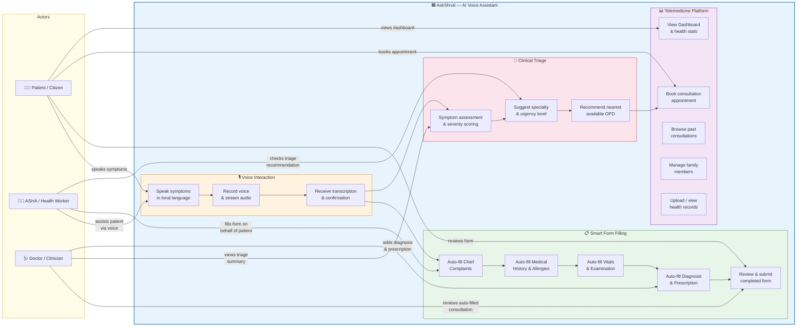

# AIForBharat-DeccanRisers-AskShruti

Bringing voice-first digital health to 500M+ Indians. AI assistant for accessible, multilingual teleconsultation booking.

**Tagline:** The AI Voice Assistant for India's Digital Health Mission.

## The Pitch

The eSanjeevani platform is a national triumph, but its mandatory digital intake forms can be a significant hurdle for many citizens—particularly the elderly, those with low digital literacy, or individuals who find it difficult to express medical issues in writing.

AskShruti! solves this critical last-mile problem. It is a friendly, conversational AI assistant, accessible from the bottom right corner of the screen, that allows any patient to fill the entire eSanjeevani case-intake form simply by speaking in their native language. It transforms a complex data entry task into a simple, natural conversation, making digital healthcare truly accessible for all.

## The "AskShruti!" User Journey

### Initiation
The patient visits the eSanjeevani "Create Case" page. Instead of tackling the form, they click on the friendly "AskShruti!" chatbot icon in the bottom right corner.

### Conversation
AskShruti! opens and greets the patient in their chosen language (e.g., Hindi):

> "Namaste! I am your AI health assistant. To create your case file for the doctor, please tell me about your current health problems, any past illnesses, and the medications you are taking."

### The Patient's Story
The patient speaks naturally, without worrying about structure:

> "Namaste. Mujhe pichle teen din se bahut khansi aur kamzori hai. Thoda saans bhi phoolta hai. Mujhe high blood pressure ki purani samasya hai aur main uski dawa roz leta hoon. Iska naam... [checks strip] ...Amlodipine hai. Mujhe kisi cheez se allergy nahi hai."

**Translation:** "Hello. I have a bad cough and weakness for the last three days. I also have some shortness of breath. I have a history of high blood pressure and I take daily medication for it. The name is... Amlodipine. I don't have any allergies."

### Use case Diagram

### Architecture Diagram

```mermaid
flowchart TB
    subgraph Client["🖥️  Client Layer"]
        direction LR
        Browser["React 18 + TypeScript\n(Vite SPA)"]
        VoiceUI["🎙️ Voice Capture\nWeb Audio API / MediaRecorder"]
        ChatUI["💬 AskShruti\nChatbot Widget"]
        FormUI["📋 Consultation\nAccordion Form"]
        DashUI["📊 Dashboard\n& Statistics"]
    end

    subgraph Gateway["🌐  API Gateway / BFF"]
        direction LR
        REST["REST API\n(Node.js / FastAPI)"]
        WS["WebSocket\nReal-time streaming"]
        Auth["🔐 Auth & Session\nJWT / OAuth 2.0"]
    end

    subgraph AI["🤖  AI & NLP Services"]
        direction TB
        subgraph Speech["Speech Pipeline"]
            STT["🗣️ Speech-to-Text\nBhashini / Whisper"]
            TTS["🔊 Text-to-Speech\nBhashini / Azure TTS"]
            LangDetect["🌍 Language Detection\n12+ Indian Languages"]
        end
        subgraph NLP["NLP & Reasoning"]
            LLM["🧠 LLM\nGPT-4o / Llama 3\nMedical fine-tuned"]
            NER["📌 Medical NER\nSymptom / Drug Extraction"]
            Intent["🎯 Intent Classification\nForm-field Mapping"]
        end
        subgraph Clinical["Clinical Intelligence"]
            TriageEngine["🏥 Triage Engine\nSeverity Scoring"]
            FormMapper["📝 Form Auto-Fill\nField Mapping Engine"]
            SpecRec["👨‍⚕️ Specialty\nRecommendation"]
        end
    end

    subgraph Data["💾  Data & Storage"]
        direction LR
        PG["🐘 PostgreSQL\nPatient & Consultation\nRecords"]
        Redis["⚡ Redis\nSession Cache\n& Rate Limiting"]
        S3["📦 Object Store\n(S3 / Azure Blob)\nAudio & Documents"]
        Vector["🧲 Vector DB\n(Qdrant / Pinecone)\nMedical Knowledge"]
    end

    subgraph Infra["☁️  Infrastructure"]
        direction LR
        Docker["🐳 Docker\nContainerized\nMicroservices"]
        K8s["⚙️ Kubernetes\nOrchestration\n& Auto-scaling"]
        CDN["🌐 CDN\nStatic Assets\n& Edge Cache"]
        Monitor["📈 Observability\nPrometheus\nGrafana · Loki"]
    end

    subgraph Security["🔒  Security & Compliance"]
        direction LR
        Encrypt["🔐 TLS 1.3+\nAES-256 at rest"]
        Consent["✅ Consent\nManagement"]
        Audit["📜 Audit Logs\n& DPDP Act"]
        RBAC["👤 RBAC\nRole-based Access"]
    end

    subgraph External["🔗  External Integrations"]
        direction LR
        eSanjeevani["🏛️ eSanjeevani\nTelemedicine Platform"]
        Bhashini["🇮🇳 Bhashini API\nLanguage Services"]
        ABHA["🆔 ABHA / ABDM\nHealth ID"]
        Payment["💳 Payment\nGateway"]
    end

    Browser --> REST
    VoiceUI -->|"audio stream"| WS
    ChatUI --> REST
    FormUI --> REST
    DashUI --> REST

    REST --> LLM
    REST --> FormMapper
    WS -->|"audio chunks"| STT
    STT --> LangDetect
    LangDetect --> NER
    NER --> Intent
    Intent --> FormMapper
    LLM --> TriageEngine
    TriageEngine --> SpecRec
    FormMapper -->|"auto-filled JSON"| REST
    SpecRec -->|"recommendation"| REST
    TTS -->|"audio response"| WS

    LLM --> Vector
    FormMapper --> PG
    TriageEngine --> PG
    REST --> Redis
    STT --> S3

    Docker --> K8s
    K8s --> Monitor
    CDN --> Browser

    Auth --> RBAC
    Encrypt -.->|"encrypts"| PG
    Encrypt -.->|"encrypts"| S3
    Consent -.->|"governs"| STT
    Audit -.->|"logs"| REST

    REST --> eSanjeevani
    STT --> Bhashini
    TTS --> Bhashini
    REST --> ABHA
    REST --> Payment

    style Client fill:#e3f2fd,stroke:#1565c0,stroke-width:2px
    style Gateway fill:#fff8e1,stroke:#f9a825,stroke-width:2px
    style AI fill:#e8f5e9,stroke:#2e7d32,stroke-width:2px
    style Speech fill:#f1f8e9,stroke:#558b2f,stroke-width:1px
    style NLP fill:#e8f5e9,stroke:#388e3c,stroke-width:1px
    style Clinical fill:#c8e6c9,stroke:#1b5e20,stroke-width:1px
    style Data fill:#fce4ec,stroke:#c62828,stroke-width:2px
    style Infra fill:#f3e5f5,stroke:#6a1b9a,stroke-width:2px
    style Security fill:#fff3e0,stroke:#e65100,stroke-width:2px
    style External fill:#e0f7fa,stroke:#00695c,stroke-width:2px
```

### The AI Magic (Behind the Scenes)

In seconds, AskShruti! processes this single voice note:

- **Vernacular Transcription:** The AI accurately converts the Hindi audio into text.
- **Clinical Entity Extraction:** A powerful Generative AI model reads the text and identifies key clinical entities:
  - Chief Complaints: Cough, Weakness, Shortness of breath
  - Medical History: Hypertension
  - Active Medication: Amlodipine
  - Allergies: None reported
- **Structured Data Mapping:** The AI intelligently maps these extracted entities to the specific fields on the eSanjeevani form.
- **Instant & Verifiable Results:** The patient sees the entire web form populate automatically with the correct information in English. They can quickly review the pre-filled fields for accuracy and click "Save & Next", completing a 10-minute task in 30 seconds.
 
